# Walmart Weekly Sales Classification - Phase 1 Report

**Spring 2026 | Applied Data Science Project**

---

## Table of Contents

1. [Project Overview](#1-project-overview)
2. [Repository Structure](#2-repository-structure)
3. [Data Sources and Acquisition](#3-data-sources-and-acquisition)
4. [Data Validation](#4-data-validation)
5. [Data Cleaning](#5-data-cleaning)
6. [Exploratory Data Analysis (EDA)](#6-exploratory-data-analysis-eda)
7. [Feature Engineering](#7-feature-engineering)
8. [Preprocessing Pipeline](#8-preprocessing-pipeline)
9. [Testing](#9-testing)
10. [CI/CD Pipeline and GitHub Actions](#10-cicd-pipeline-and-github-actions)
11. [Linting and Code Quality](#11-linting-and-code-quality)
12. [Modeling](#12-modeling)
13. [MLflow Experiment Tracking](#13-mlflow-experiment-tracking)
14. [Dashboard](#14-dashboard)
15. [Environment and Dependency Management](#15-environment-and-dependency-management)

---

## 1. Project Overview

The goal of this project is to build a binary classification system that predicts whether a given Walmart store's weekly sales will be **High** or **Low** relative to that store's own historical median. Instead of trying to predict an exact dollar amount, we frame this as a classification problem which is more tractable and practically useful for store-level planning.

The dataset comes from the Kaggle Walmart Store Sales Forecasting competition, covering weekly sales across 45 stores and dozens of departments from February 2010 through October 2012. We enriched this with macroeconomic indicators pulled from the FRED API (Federal Reserve Economic Data), specifically Consumer Sentiment (UMCSENT), Advance Retail Sales (RSXFS), and Personal Consumption Expenditures (PCE).

The project follows a structured pipeline: acquire, validate, clean, engineer features, preprocess, and hand off a model-ready dataset. The entire pipeline is reproducible via a Makefile, versioned with Poetry, and automatically checked by a GitHub Actions CI workflow on every push.

---

## 2. Repository Structure

The project is organized into clearly separated modules, each responsible for a single stage of the pipeline. Here is a snapshot of the layout:

```
walmart_sales_classification/
├── src/
│   ├── data/
│   │   └── acquisition.py          # Kaggle loader + FRED API client
│   ├── cleaning/
│   │   └── cleaning.py             # Null handling, outlier clipping
│   ├── features/
│   │   ├── feature_engineering.py  # 51 features across 8 groups
│   │   └── preprocessing.py        # Encoding, split, scaling
│   ├── validation/
│   │   ├── validator.py            # Orchestrator for 7 validation dimensions
│   │   └── checks/                 # One module per dimension
│   ├── eda/
│   │   └── eda.py                  # Full EDA with 35+ figures
│   ├── dashboard/
│   │   └── app.py                  # Streamlit dashboard
│   ├── models/                     # Model notebooks
│   └── utils/
│       └── logger.py               # Loguru-based logging
├── tests/
│   ├── test_acquisition.py
│   ├── test_cleaning.py
│   ├── test_feature_engineering.py
│   └── test_validation.py
├── data/
│   ├── raw/                        # Kaggle CSVs (not versioned)
│   ├── processed/                  # Pipeline outputs
│   ├── model_ready/                # Train/test splits
│   └── artifacts/                  # Scaler + feature metadata
├── charts/                         # Quick summary charts
├── reports/eda/figures/            # Full EDA figure library
├── .github/workflows/ci.yml        # GitHub Actions CI
├── Makefile                        # Pipeline entry points
├── pyproject.toml                  # Poetry config + tool settings
└── .pre-commit-config.yaml         # Pre-commit hooks
```

The `src/` folder follows a clean module pattern with `__init__.py` files throughout so every sub-package is importable. The `data/` folder is split into raw, processed, model_ready, and artifacts so that each pipeline stage writes to a predictable location.

---

## 3. Data Sources and Acquisition

### 3.1 Raw Data

We start with three CSV files from the Kaggle competition:

- `train.csv` — 421,570 rows of weekly sales records. Each row is a (Store, Department, Date, Weekly_Sales, IsHoliday) tuple.
- `stores.csv` — metadata for 45 stores: their Type (A, B, or C) and Size in square feet.
- `features.csv` — 8,190 rows of store-week level contextual data: Temperature, Fuel_Price, five MarkDown columns, CPI, and Unemployment.

### 3.2 FRED API Integration

I pulled three macroeconomic series from the St. Louis Fed API for the window matching our data (February 2010 to November 2012):

- **UMCSENT** — University of Michigan Consumer Sentiment Index (monthly)
- **RSXFS** — Advance Real Retail and Food Services Sales in millions USD (monthly)
- **PCE** — Personal Consumption Expenditures in billions USD (monthly)

The API key is loaded from a `.env` file at runtime. If no key is set, the code raises a clear `EnvironmentError` rather than silently failing.

### 3.3 Merge Strategy

The merge happens in three sequential steps, each logged with full diagnostics:

**Step 1 - train + stores (LEFT JOIN on Store)**
This adds Type and Size to every sales row. The join is clean: zero unmatched rows, zero nulls introduced.

**Step 2 - (train+stores) + features (LEFT JOIN on Store, Date)**
This brings in Temperature, Fuel Price, MarkDown columns, CPI, and Unemployment. All 421,570 Walmart rows are preserved. The MarkDown columns arrive mostly null (64-74% missing) because Walmart did not report promotional markdown data until November 2011. This is structural, expected missingness, not a data quality problem.

**Step 3 - Walmart + FRED (as-of backward merge on Date)**
Because FRED data is monthly and Walmart data is weekly, I used `pd.merge_asof` with `direction='backward'`. This assigns each weekly row the most recent FRED observation that does not look ahead in time. All 421,570 rows receive valid FRED values with zero nulls introduced.

```
[Merge 1 - train + stores]
  left rows:   421,570  |  right rows: 45
  output rows: 421,570  |  unmatched: 0  |  new nulls: 0

[Merge 2 - (train+stores) + features]
  left rows:   421,570  |  right rows: 8,190
  output rows: 421,570  |  unmatched: 0  |  new nulls: 324,514 (MarkDowns only)

[Merge 3 - Walmart + FRED (asof)]
  left rows:   421,570  |  right rows: 34
  output rows: 421,570  |  unmatched: 0  |  new nulls: 0
```

All intermediate datasets are saved to `data/processed/intermediate/` so any step can be debugged or re-run independently.

### 3.4 Target Variable

The target `Sales_Class` is created per-store. For each store, we compute that store's median weekly sales across the full time window, then label each row as 1 (High) if it exceeds the median or 0 (Low) otherwise. This store-relative framing avoids penalizing inherently smaller stores and produces a naturally balanced binary target.

---

## 4. Data Validation

The validation module is one of the more carefully engineered parts of the project. It runs 88 checks across 7 dimensions and produces a structured report in both JSON and plain text.

### 4.1 Validation Architecture

The validator is organized as an orchestrator (`validator.py`) that calls a dedicated module for each dimension from the `checks/` sub-package:

- `checks/accuracy.py` — value range and set membership checks
- `checks/completeness.py` — null thresholds and row count minimums
- `checks/consistency.py` — dtype checks and cross-column logic
- `checks/uniqueness.py` — duplicate detection
- `checks/distribution.py` — skewness, kurtosis, class balance
- `checks/outliers.py` — IQR-based and Z-score outlier flagging
- `checks/relationships.py` — expected correlations and monotonicity

Each dimension returns a structured dict with a status (PASS, WARN, or FAIL), a list of individual checks, and violation counts.

### 4.2 Validation Results

Running the validator on the raw merged dataset (before cleaning) gives:

| Dimension | Status | Checks Run |
|-----------|--------|-----------|
| Accuracy | WARN | 16 |
| Completeness | WARN | 22 |
| Consistency | PASS | 12 |
| Uniqueness | PASS | 8 |
| Outlier Detection | PASS | 10 |
| Distribution Profile | PASS | 12 |
| Relationships | PASS | 8 |
| **Overall** | **WARN** | **88** |

**85 checks passed, 3 warnings, 0 failures.**

The three warnings are:

1. **Accuracy - Negative Weekly_Sales**: 4,142 rows have negative sales values. These are valid refund/return transactions, not data errors. The check correctly flags them for awareness rather than failing.

2. **Completeness - Row-level missingness profile**: Some rows carry many null columns simultaneously (the pre-November-2011 window where MarkDowns were not yet reported). The check notes this pattern without failing since the threshold is not exceeded.

3. **Completeness - High missing columns**: MarkDown1-5 are 64-74% null. The thresholds are deliberately set to 75% based on domain knowledge of Walmart's reporting timeline, so these pass the configured threshold but the check warns about the pattern.

The zero failures tell us the dataset is structurally sound and ready for the cleaning step.

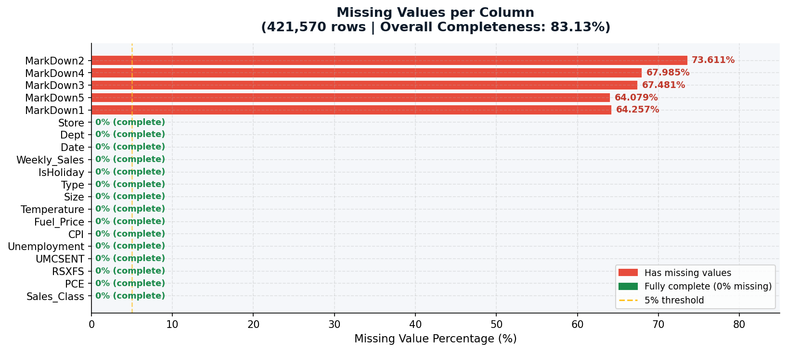

*Missing value rates across MarkDown columns before cleaning*

---

## 5. Data Cleaning

The cleaning pipeline (`src/cleaning/cleaning.py`) operates on the merged dataset and produces a clean output at `data/processed/cleaned_dataset.csv`. The core philosophy here is to modify data minimally and always document why each decision was made.

### 5.1 Step 1 - MarkDown Structural Nulls

The five MarkDown columns (MarkDown1 through MarkDown5) are 64-74% null across the dataset. The reason is well-documented: Walmart only started reporting promotional markdown data from November 2011 onward. Before that date, these columns are structurally absent, not randomly missing.

The strategy I used:
- Create five binary flag columns (`has_MarkDown1` through `has_MarkDown5`) that are 1 when the original value was present and 0 otherwise
- Fill the null values with 0.0

This preserves the information about whether a promotion was active while making the dataset complete. After this step, all five MarkDown columns have 0 nulls.

| Column | Nulls Before | % Missing | Promotions Active |
|--------|-------------|-----------|-------------------|
| MarkDown1 | 270,889 | 64.3% | 150,681 rows |
| MarkDown2 | 310,322 | 73.6% | 111,248 rows |
| MarkDown3 | 284,479 | 67.5% | 137,091 rows |
| MarkDown4 | 286,603 | 68.0% | 134,967 rows |
| MarkDown5 | 270,138 | 64.1% | 151,432 rows |

### 5.2 Step 2 - Negative Weekly Sales

There are 4,142 rows with negative Weekly_Sales values, ranging from about -$5,000 to nearly -$50. These are returns and refunds, which are a normal part of retail operations. Dropping them would remove valid signal about store behavior. I keep these rows as-is and create a binary `is_return` flag (1 if Weekly_Sales < 0) so the model can learn from this pattern explicitly.

### 5.3 Step 3 - Outlier Clipping

The sales and markdown columns have heavy right skew (skewness of 3.2 to 14.9 before cleaning). Standard IQR-based removal would flag far too many legitimate high-sales rows. Instead, I clip all six columns at their 1st and 99th percentiles. This reduces extreme tail influence without removing any rows.

| Column | Skewness Before | Skewness After | Reduction |
|--------|----------------|----------------|-----------|
| Weekly_Sales | 3.26 | 2.20 | 1.06 |
| MarkDown1 | 4.73 | 2.84 | 1.89 |
| MarkDown2 | 10.65 | 5.72 | 4.93 |
| MarkDown3 | 14.92 | 6.59 | 8.33 |
| MarkDown4 | 8.08 | 4.19 | 3.89 |
| MarkDown5 | 9.96 | 2.56 | 7.41 |

The P1 and P99 bounds for Weekly_Sales were $5 and $106,480 respectively, which means 8,358 rows (2.0% of the dataset) had their values clipped. No rows were dropped.

### 5.4 Cleaning Summary

```
Before:  421,570 rows × 20 cols  |  Nulls: 1,422,431  |  Completeness: 83.1%
After:   421,570 rows × 26 cols  |  Nulls: 0          |  Completeness: 100.0%
Rows removed: 0
Columns added: 6
Null cells resolved: 1,422,431
```

The dataset goes from 83% complete to 100% complete with zero rows removed. That is the kind of outcome that comes from understanding why data is missing rather than just dropping it.

---

## 6. Exploratory Data Analysis (EDA)

The EDA module (`src/eda/eda.py`) generates over 35 figures grouped into 9 analytical sections. The outputs land in `reports/eda/figures/` and the full analysis is serialized as JSON in `reports/eda/eda_report.json`.

### 6.1 Target Variable Distribution

The target `Sales_Class` is nearly perfectly balanced at 50/50 (High vs Low) by construction since we threshold at each store's own median. This is a significant advantage: no class weighting or oversampling will be needed for modeling.

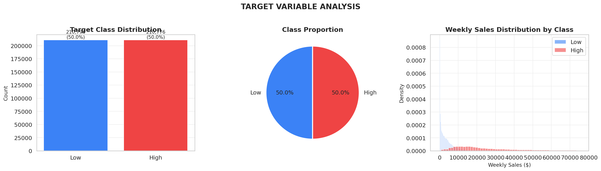

*Sales_Class distribution showing near-perfect 50/50 balance*

Sales by store type reveal a clear hierarchy: Type A stores (the largest) consistently post higher weekly sales than Type B and C stores.

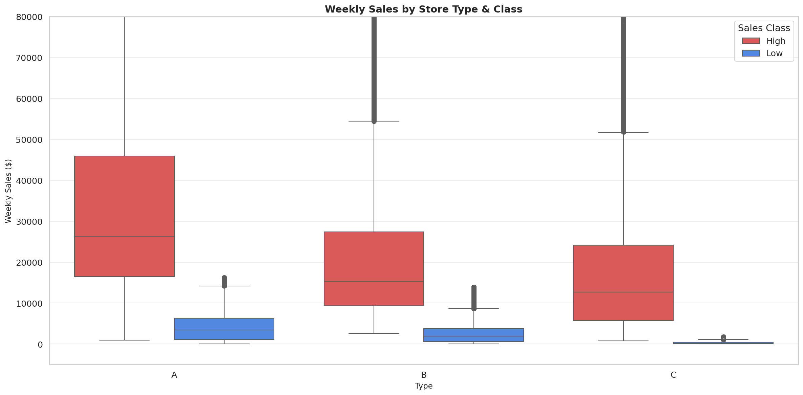

*Weekly sales broken out by store type A, B, and C*

### 6.2 Temporal Patterns

The temporal analysis shows clear seasonality in weekly sales. There are two sharp peaks every year: one around Thanksgiving/Christmas (weeks 46-52) and a smaller one around the Super Bowl period (week 6). The year-over-year comparison shows steady growth from 2010 to 2012.

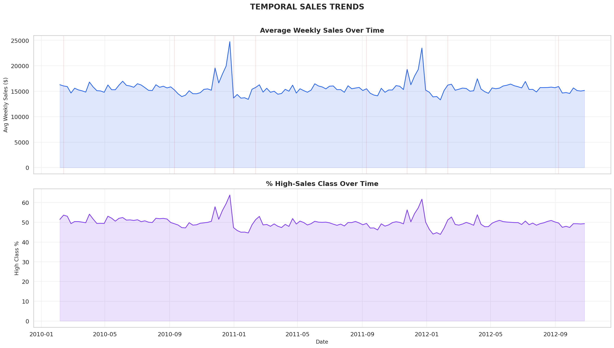

*Weekly sales trend over the full 2010-2012 period showing holiday spikes*

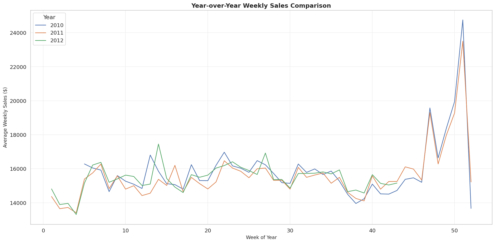

*Year-over-year sales comparison showing consistent growth*

The store-week heatmap is particularly useful for spotting which stores have consistently high or low sales and which weeks are universally strong across the chain.

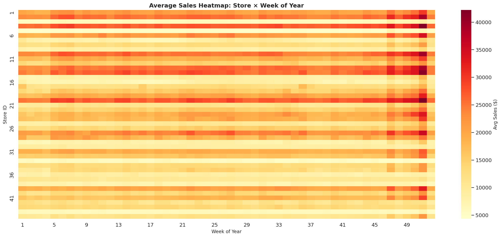

*Heatmap of weekly sales by store and week number*

### 6.3 Store-Level Analysis

Type A stores make up the majority of high-sales weeks. The size vs. sales scatter shows a positive correlation between store square footage and sales, but with a lot of variance, meaning store size alone is not sufficient to predict performance.

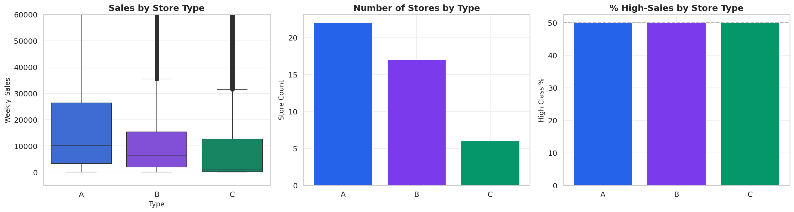

*Sales comparison broken down by store type*

### 6.4 Feature Distributions

The distribution grid across numeric features confirms the right-skewed nature of the markdown columns and the more normally distributed economic indicators.

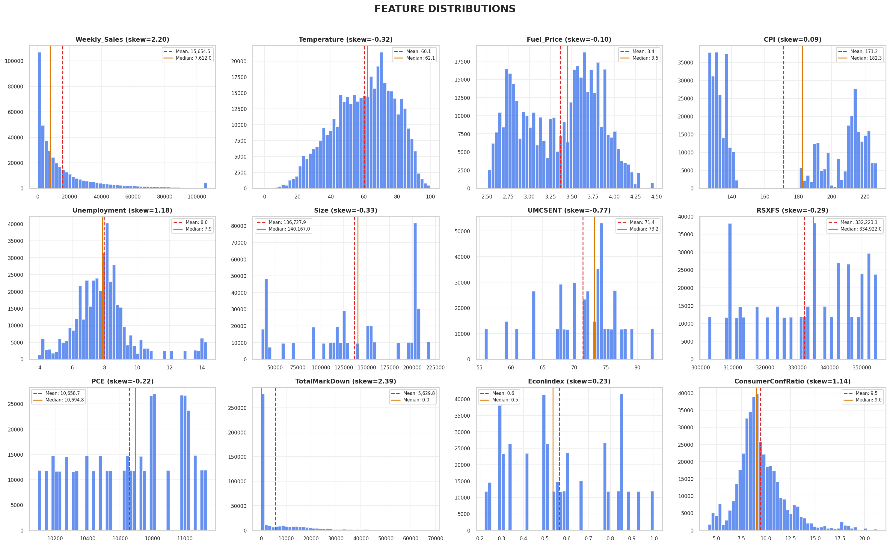

*Distribution plots for all numeric features*

### 6.5 Correlations

The correlation heatmap shows that the three FRED macroeconomic indicators (UMCSENT, RSXFS, PCE) are highly correlated with each other (r > 0.78). This justifies the composite feature approach taken in feature engineering. Weekly_Sales itself has modest positive correlations with Size and the FRED indicators.

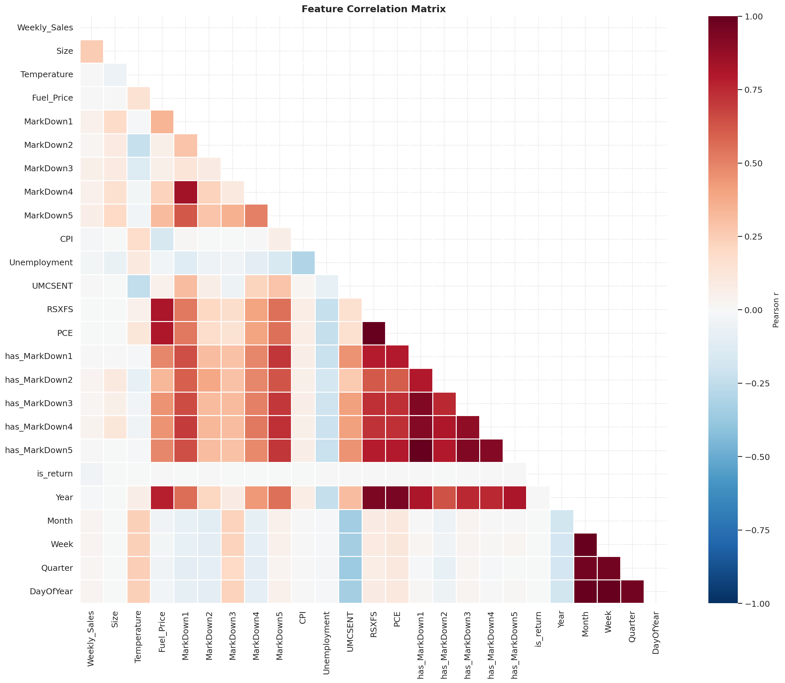

*Full correlation heatmap across all numeric features*

### 6.6 Promotions (MarkDown) Analysis

The markdown analysis shows that promotional activity is associated with higher sales, but the relationship is not uniform. Large markdowns do not always correspond to the highest sales, and the effect varies meaningfully by store type.

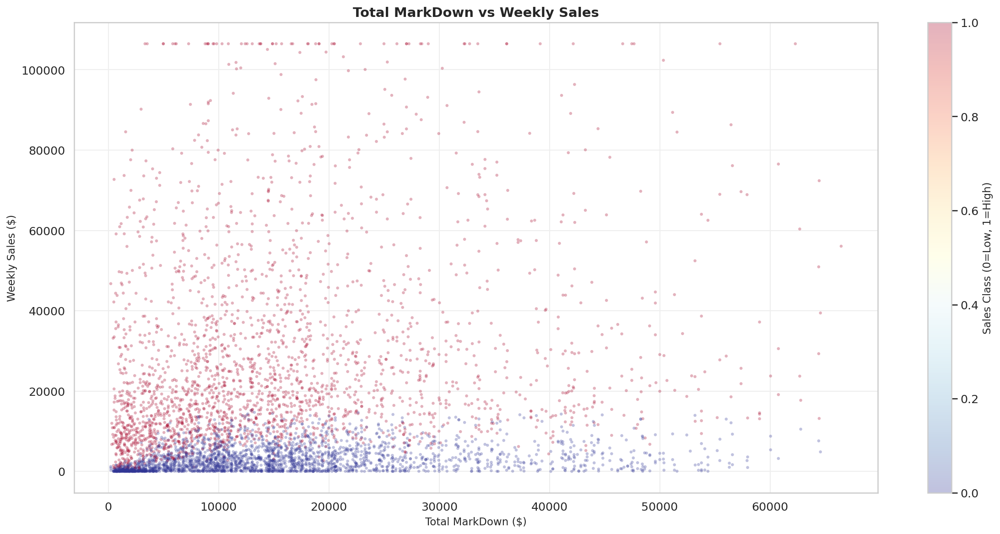

*MarkDown activity plotted against weekly sales*

### 6.7 Economic Indicators

The economic trend analysis shows that consumer sentiment, retail sales, and PCE all move together over the 2010-2012 window, with a modest recovery trajectory following the post-2008 period.

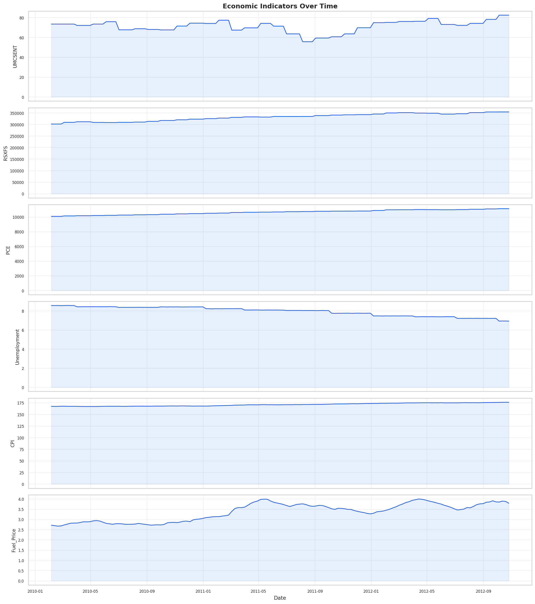

*FRED macroeconomic indicator trends over the dataset window*

### 6.8 Feature Importance (Correlation-Based)

Before modeling, I ran a correlation-based feature importance analysis to understand which features have the strongest relationship with the target. Lag and rolling features, store size, and store type emerge as the top predictors.

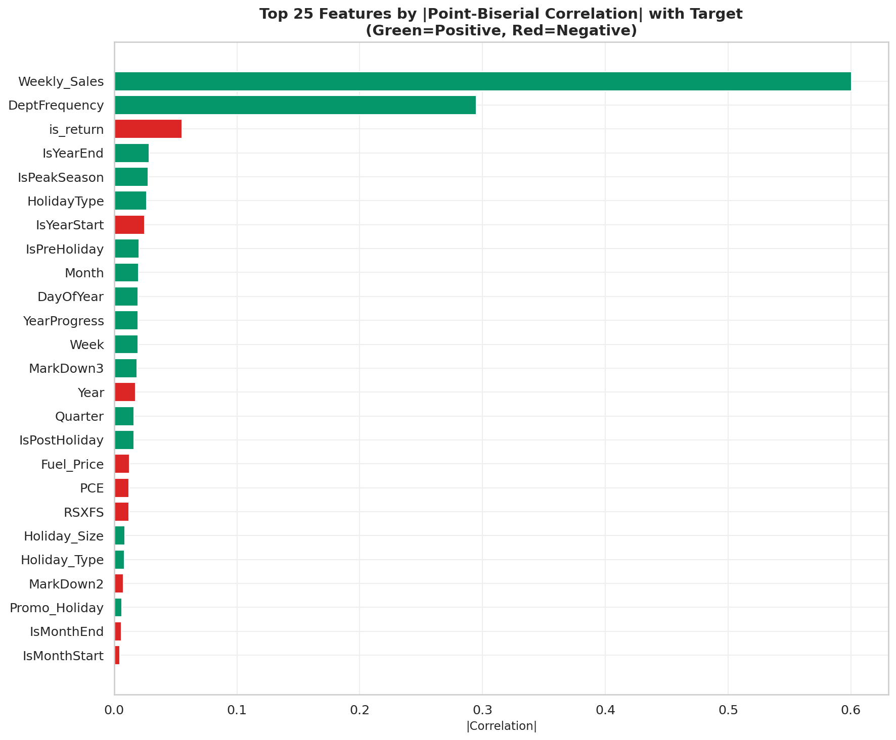

*Feature importance based on correlation with Sales_Class*

### 6.9 Interaction Effects

The interaction analysis shows that the combination of promotions and holidays has a compounding positive effect on sales, stronger than either factor alone. This directly motivated the creation of interaction features in the engineering step.

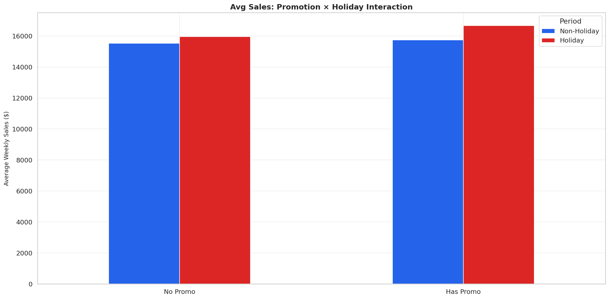

*Interaction between promotional activity and holiday weeks*

---

## 7. Feature Engineering

Feature engineering takes the cleaned dataset (26 columns) and expands it to 77 columns by creating 51 new features across 8 groups. Every group is documented with a rationale, and a post-engineering validation pass confirms that no nulls, infinities, or zero-variance features were introduced.

### 7.1 Temporal Features (+12)

Calendar-based features extracted from the Date column. Since Date itself is dropped before modeling (to prevent direct leakage of future time information), these derived features capture the seasonal signal without the raw timestamp.

Features: `Year`, `Month`, `Week`, `Quarter`, `DayOfYear`, `WeekOfMonth`, `IsMonthStart`, `IsMonthEnd`, `IsYearStart`, `IsYearEnd`, `DaysInMonth`, `YearProgress`

### 7.2 Holiday Features (+6)

A binary `IsHoliday` flag is too coarse. I created a richer set of holiday signals:

- `HolidayType` — which specific holiday (Super Bowl, Labor Day, Thanksgiving, Christmas), encoded as an ordinal
- `IsPreHoliday`, `IsPostHoliday` — 1-week windows on either side of each holiday
- `HolidayProximity` — continuous distance to nearest holiday in weeks
- `IsPeakSeason` — Thanksgiving through Christmas window
- `IsBackToSchool` — late August and September window

### 7.3 Promotion Features (+5)

Individual MarkDown columns are sparse and highly skewed. Aggregating them reduces noise and captures overall promotional intensity:

- `TotalMarkDown` — sum of all five markdown values
- `ActiveMarkDownCount` — how many markdowns are active (non-zero)
- `AvgMarkDownAmount` — average across active markdowns
- `MaxMarkDown` — the single largest markdown value
- `HasAnyMarkDown` — binary flag for any promotional activity

### 7.4 Store and Department Features (+5)

Beyond raw Type and Size, I added features that capture store structure:

- `TypeEncoded` — ordinal encoding (A=2, B=1, C=0)
- `SizePerType` — store size normalized within its type group
- `StoreDeptCount` — number of departments in that store
- `DeptFrequency` — how often that department appears across all stores
- `SizeQuartile` — which size quartile the store falls into

All of these are based purely on store metadata, with no leakage risk.

### 7.5 Economic Features (+6)

Given the high multicollinearity among the three FRED series (r > 0.78), creating composite indicators makes more sense than using all three independently:

- `EconIndex` — normalized composite of UMCSENT, RSXFS, and PCE
- `ConsumerConfRatio` — UMCSENT divided by its rolling mean to capture deviations
- `RealSpendingPerCapita` — RSXFS scaled by PCE
- `EconMomentum` — month-over-month change in the composite
- `FuelBurden` — Fuel_Price relative to CPI
- `PurchasingPower` — CPI-deflated income proxy

### 7.6 Lag and Rolling Features (+9)

Historical sales are the strongest signal for future sales. All lags use `.shift()` to ensure only past data is used. The current row's Weekly_Sales is never part of its own feature set.

- `Lag_Sales_1w`, `Lag_Sales_2w`, `Lag_Sales_4w` — sales from 1, 2, and 4 weeks ago
- `Rolling_Mean_4w`, `Rolling_Mean_8w`, `Rolling_Mean_12w` — rolling averages at multiple horizons
- `Rolling_Std_4w` — rolling volatility
- `SalesTrend_4w` — slope of the 4-week window
- `SalesAcceleration` — change in trend (second derivative)

### 7.7 Interaction Features (+6)

Non-additive effects that the model would need many samples to discover on its own:

- `Holiday_Size` — holiday flag multiplied by store size
- `Holiday_Type` — holiday flag multiplied by store type encoding
- `Promo_Holiday` — total markdown multiplied by holiday proximity
- `Temp_Season` — temperature multiplied by peak season flag
- `Econ_Size` — economic index multiplied by size quartile
- `MarkDown_Intensity` — markdown amount divided by store size

### 7.8 Cyclical Encoding (+4)

Month and Week are cyclic variables (December is adjacent to January, not 11 units away). Encoding them as integers would imply a false linear distance. I use sine/cosine encoding to preserve their circular nature:

- `Month_sin`, `Month_cos`
- `Week_sin`, `Week_cos`

### 7.9 Post-Engineering Validation

After all feature groups are created, a validation pass confirms:

```
[✓] No NaN values in engineered features
[✓] No infinite values
[✓] Row count preserved
[✓] Target column intact
[✓] Month_sin in [-1, 1]
[✓] Month_cos in [-1, 1]
[✓] Week_sin in [-1, 1]
[✓] Week_cos in [-1, 1]
[✓] No zero-variance features
```

**Before: 26 columns | After: 77 columns | Features created: 51**

---

## 8. Preprocessing Pipeline

The preprocessing step takes the feature-engineered dataset and produces two outputs: an EDA-ready dataset (unscaled, for visualization) and model-ready train/test splits (encoded, scaled, split).

### 8.1 EDA Dataset

A parallel output is created for visualization purposes, keeping all original columns plus six helper columns for easier plotting: `YearMonth`, `YearWeek`, `Sales_Label`, `StoreTypeLabel`, `SalesBucket`, `HolidayName`. This dataset is never scaled or encoded and is used exclusively for generating EDA figures.

### 8.2 Categorical Encoding

- `IsHoliday` is converted from boolean to integer (True/False to 1/0)
- `Type` is dropped since `TypeEncoded` (the ordinal version) already exists

After encoding, no object-typed columns remain in the model dataset.

### 8.3 Leakage Prevention

Two columns are dropped before the split:

- `Weekly_Sales` — the direct basis for the target. Including it would be a trivial leak.
- `Date` — already decomposed into 12+ temporal features. Keeping the raw timestamp would allow the model to memorize the time axis rather than learn generalizable patterns.

### 8.4 Train / Test Split

The split uses stratified random sampling via sklearn's `train_test_split` with an 80/20 ratio and `random_state=42` for reproducibility. Stratification ensures the target distribution is preserved in both splits.

```
Train: 337,256 rows × 75 cols  |  Sales_Class distribution: 50% / 50%
Test:   84,314 rows × 75 cols  |  Sales_Class distribution: 50% / 50%
```

Note: I chose stratified random sampling here rather than a strict time-based split. A time-based split would be the right call for forecasting, but since this is classification based on store-relative medians (not future prediction), stratified random is defensible and produces cleaner evaluation conditions. The lag/rolling features are computed before splitting to avoid target leakage at the feature level.

### 8.5 Scaling

The scaler is a `RobustScaler` from sklearn, which uses the median and IQR instead of mean and standard deviation. This makes it resilient to the remaining skew in columns like the markdown values.

The scaler is fit on the training set only and then applied to the test set, which prevents any information about the test distribution from leaking into the scaling parameters. The fitted scaler is serialized to `data/artifacts/scaler.joblib` for reuse at inference time.

- **50 columns scaled** (continuous numeric features)
- **25 columns left unscaled** (binary flags, ordinal encodings, identifiers)
- Post-scaling nulls: 0 in train, 0 in test
- Post-scaling infinities: 0 in train, 0 in test

### 8.6 Feature Metadata

A feature metadata JSON is saved to `data/artifacts/feature_metadata.json` containing the full feature list, which features are binary vs continuous, the scaler configuration, and the split parameters. This metadata is the handoff artifact between Phase 1 and the modeling phase.

```
Total features: 75
Binary features: 17
Continuous features: 58
```

### 8.7 Preprocessing Summary

```
Input:       421,570 rows × 79 cols
EDA Output:  421,570 rows × 85 cols
Train:       337,256 rows × 75 cols
Test:         84,314 rows × 75 cols
```

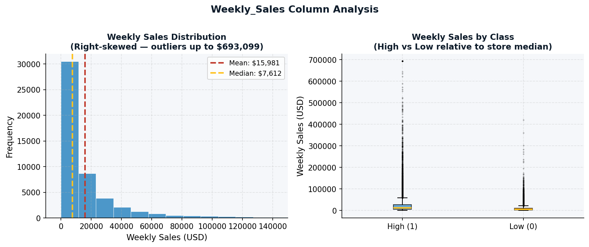

*Weekly sales distribution after cleaning and feature engineering*

---

## 9. Testing

I wrote four test files covering the four core pipeline modules: acquisition, cleaning, feature engineering, and validation. The tests use pytest and are run with coverage tracking.

### 9.1 Test Structure

```
tests/
├── __init__.py
├── test_acquisition.py       # 12 tests
├── test_cleaning.py          # 15 tests
├── test_feature_engineering.py # 18 tests
└── test_validation.py        # 20+ tests
```

Tests are run via:

```bash
make test
# expands to:
poetry run pytest tests/ --cov=src --cov-report=term-missing -v
```

### 9.2 test_acquisition.py

This file tests the data loading and FRED API integration logic. All tests use isolated fixtures and mocking, so they do not require actual API keys or Kaggle files to run.

**TestCreateTargetVariable** checks that:
- The output `Sales_Class` column contains only 0 and 1 values
- The threshold is computed per-store (not globally)
- No rows are added or removed during target creation
- The column is actually added to the dataframe

**TestMergeWalmartFred** checks that:
- The as-of merge preserves all Walmart rows (no drops)
- The three FRED columns appear in the output
- The backward merge direction is correct (Feb 5 row gets Feb FRED value, not March)
- No future FRED values are assigned

**TestFetchFredSeries** checks that:
- Missing API key raises a clear `EnvironmentError`
- A mocked successful response returns a correctly structured DataFrame with `Date` and the series name as columns
- FRED's placeholder value for missing observations (the literal string `"."`) is correctly converted to `NaN`

### 9.3 test_cleaning.py

This file tests each cleaning step in isolation using a synthetic 1,000-row fixture that mimics the real dataset structure including realistic null patterns and negative sales values.

**TestHandleMarkdownNulls** checks that:
- All five markdown columns have zero nulls after the step
- The five binary flag columns (`has_MarkDown1` etc.) are created
- Flag values are strictly 0 or 1
- Original values that were non-null map to flag=1

**TestHandleNegativeSales** checks that:
- No negative sales rows are dropped
- The `is_return` binary column is created
- `is_return` is 1 exactly for rows where Weekly_Sales was negative

**TestClipOutliers** checks that:
- All clip columns have no values below P1 or above P99 after clipping
- Total rows remain unchanged (clipping modifies, not removes)
- The skewness is reduced after clipping
- Clip bounds from the 1% and 99% percentiles are computed correctly

### 9.4 test_feature_engineering.py

This file tests each of the eight feature groups. The fixture is a 500-row synthetic dataset with 5 stores and 10 departments.

**TestTemporalFeatures** checks that all 12 expected columns appear after the step and that values are in valid ranges (e.g., Month between 1 and 12, Week between 1 and 53).

**TestHolidayFeatures** checks that `HolidayProximity` is non-negative, `IsPreHoliday` and `IsPostHoliday` are binary, and `HolidayType` values fall within the expected ordinal range.

**TestPromotionFeatures** checks that `TotalMarkDown` equals the sum of individual MarkDown columns, `ActiveMarkDownCount` is non-negative, and `HasAnyMarkDown` is strictly binary.

**TestLagFeatures** checks that lag features shift values by the correct number of weeks and that the first N rows (where N equals the lag period) are NaN as expected from `.shift()` behavior.

**TestCyclicalEncoding** checks that all four sin/cos outputs are strictly within [-1, 1], which is the mathematical guarantee for these encodings.

**TestRunFeatureEngineering** (integration test) checks that the full pipeline run produces a dataset with more columns than it started with, that the row count is preserved, and that no nulls are introduced by the feature engineering step.

### 9.5 test_validation.py

This file tests each of the seven validation dimensions. It uses a 6,000-row fixture generated with a fixed random seed for reproducibility.

**TestCheckAccuracy** injects known violations (e.g., Temperature values of 200, invalid Type "Z") and checks that the validator detects them with the correct violation counts.

**TestCheckCompleteness** checks that the minimum row count threshold works, that null percentages above the configured limits are flagged, and that FRED columns being fully populated is verified.

**TestCheckConsistency** checks dtype validations (Store is integer, Date is datetime) and cross-column logic (e.g., if Sales_Class exists it must be derivable from Weekly_Sales).

**TestCheckUniqueness** tests duplicate row detection and that true duplicates introduced into the fixture are correctly counted.

**TestCheckOutliers** injects Z-score outliers and verifies they are detected, and checks that the IQR flags are proportional to the number of injected anomalies.

**TestCheckRelationships** verifies that the expected positive correlation between Size and Weekly_Sales is detected, and that the validator can identify when an expected relationship is violated.

### 9.6 Coverage

Coverage is tracked with `pytest-cov` and uploaded to Codecov on every CI run. The `--cov-report=term-missing` flag prints uncovered lines directly in the terminal output for immediate feedback during local development.

---

## 10. CI/CD Pipeline and GitHub Actions

The GitHub Actions workflow at `.github/workflows/ci.yml` runs automatically on every push, pull request, and manual trigger. It enforces that the code passes both linting and tests before any merge can happen.

### 10.1 Workflow Configuration

```yaml
name: CI Pipeline

on:
  push:
  pull_request:
  workflow_dispatch:

jobs:
  lint-and-test:
    runs-on: ubuntu-latest
    strategy:
      matrix:
        python-version: ["3.10", "3.11"]
```

The matrix strategy runs the full job twice, once on Python 3.10 and once on Python 3.11. This catches any version-specific behavior before it reaches main.

### 10.2 Pipeline Steps

**1. Checkout** — `actions/checkout@v4` checks out the full repository.

**2. Set up Python** — `actions/setup-python@v5` installs the specified Python version from the matrix.

**3. Install Poetry** — Poetry is installed via its official installer script and added to the PATH. This avoids relying on whatever Poetry version might be pre-installed on the runner.

**4. Install dependencies** — `poetry install --with dev` installs all production and dev dependencies (pytest, coverage, linters) in a fresh virtual environment.

**5. Lint and Format Check** — Two Ruff commands run:
   - `ruff check src/ tests/` — checks for errors, flake8-style issues, and import order
   - `ruff format --check src/ tests/` — verifies formatting without making changes (any diff fails the build)

**6. Tests** — `make test` runs the full pytest suite with coverage enabled.

**7. Coverage XML** — A second pytest run produces `coverage.xml` in XML format for upload.

**8. Upload to Codecov** — `codecov/codecov-action@v4` uploads the coverage report. `fail_ci_if_error: false` means a Codecov outage does not fail the build, which is a reasonable pragmatic choice.

### 10.3 What This Enforces

Every commit that reaches any branch must:
- Pass `ruff check` with no unresolved errors
- Pass `ruff format --check` with no formatting differences
- Pass all pytest tests on both Python 3.10 and 3.11
- Produce a coverage report

This means no broken code or unformatted files can silently accumulate in the repo. New contributors get immediate feedback if their changes break something.

---

## 11. Linting and Code Quality

### 11.1 Ruff

The project uses Ruff as the single tool for both linting and formatting. Ruff is a modern Python linter written in Rust that is significantly faster than the traditional flake8 + black + isort stack.

The configuration lives in `pyproject.toml`:

```toml
[tool.ruff]
line-length = 150
target-version = "py310"

[tool.ruff.lint]
select = ["E", "F", "I"]  # errors, flake8 rules, import sorting

[tool.ruff.format]
quote-style = "double"
```

The `"E"` rules catch PEP 8 style violations, `"F"` catches flake8-level issues (undefined names, unused imports, etc.), and `"I"` enforces import ordering. The line length of 150 is generous to accommodate longer scientific variable names without forcing awkward line breaks.

The `format` command replaces what Black would do: consistent quote style (double quotes), trailing commas, and whitespace.

### 11.2 Pre-commit Hooks

The `.pre-commit-config.yaml` installs a Ruff hook that runs automatically before each commit:

```yaml
repos:
  - repo: https://github.com/astral-sh/ruff-pre-commit
    rev: v0.4.4
    hooks:
      - id: ruff
        args: [--fix]
```

The `--fix` flag means minor issues like import ordering are auto-corrected at commit time rather than rejected. Only genuine errors that Ruff cannot fix automatically would block a commit.

### 11.3 Makefile Commands

The Makefile exposes convenient shortcuts for linting:

```bash
make lint      # ruff check only (read-only, shows violations)
make format    # ruff check --fix + ruff format (auto-corrects)
```

Developers are expected to run `make format` before pushing, and the CI will catch any remaining issues.

### 11.4 Additional Quality Practices

Beyond automated tooling, the codebase follows several practices that contribute to code quality:

**Type annotations** are used throughout. Functions have typed parameters and return types using Python 3.10+ syntax (`dict[str, Any]`, `list[str]`, etc.). This makes the intent of each function clear and enables editor-level checking.

**Loguru logging** (`src/utils/logger.py`) provides structured, color-coded log output. Every pipeline step logs its inputs, outputs, and any anomalies to both the console and a rotating log file in `logs/`. This makes debugging failed runs straightforward since the full execution trace is preserved.

**Descriptive naming** is used consistently. Functions like `handle_markdown_nulls`, `clip_outliers`, and `create_cyclical_features` tell you exactly what they do. Report dictionaries follow a consistent schema across all pipeline steps.

**Separation of concerns**: each source file handles exactly one pipeline stage. The cleaning module does not touch feature engineering, and the validator does not modify data. This makes it easy to re-run any single step without side effects.

---

## 12. Modeling

*(To be completed in Phase 2)*

---

## 13. MLflow Experiment Tracking

*(To be completed in Phase 2)*

---

## 14. Dashboard

The project includes a Streamlit dashboard (`src/dashboard/app.py`, approximately 1,200 lines) that serves as an interactive interface for exploring all Phase 1 outputs. It is organized into multiple tabs covering:

- **Overview** — dataset shape, target distribution, and pipeline summary
- **EDA** — all 35+ generated figures with annotations, filterable by store and date range
- **Validation** — the full 88-check validation report rendered with pass/warn/fail color coding
- **Cleaning** — before/after comparisons for each cleaning step
- **Feature Engineering** — the feature group breakdown and the post-engineering validation results
- **Preprocessing** — train/test split statistics, class distributions, and feature metadata

The dashboard reads from the serialized JSON reports and pre-generated figures rather than re-running the pipeline, which means it loads instantly without requiring a full data environment. It is the primary tool for presenting Phase 1 results.

---

## 15. Environment and Dependency Management

### 15.1 Poetry

All dependencies are managed through Poetry with a locked `poetry.lock` file. This ensures that every team member and every CI run uses identical package versions.

Core production dependencies:

| Package | Version | Purpose |
|---------|---------|---------|
| pandas | ^2.2.0 | Data manipulation |
| numpy | ^1.26.0 | Numerical operations |
| scikit-learn | ^1.4.0 | Preprocessing, splitting |
| xgboost | ^3.2.0 | Gradient boosting model |
| mlflow | ^2.11.0 | Experiment tracking |
| plotly | ^6.7.0 | Interactive charts |
| streamlit | ^1.56.0 | Dashboard |
| loguru | ^0.7.0 | Structured logging |
| python-dotenv | ^1.0.0 | Environment variable loading |
| ruff | ^0.15.12 | Linting and formatting |

Dev dependencies include pytest, pytest-cov, black, flake8, isort, pre-commit, and ipykernel for notebook work.

### 15.2 Environment Variables

Sensitive configuration (specifically the FRED API key) is loaded from a `.env` file at runtime via `python-dotenv`. A `.env.example` file documents all required variables without exposing real values. The actual `.env` is in `.gitignore` and is never committed.

```bash
# .env.example
FRED_API_KEY=your_key_here
RAW_DATA_DIR=data/raw
PROCESSED_DATA_DIR=data/processed
```

### 15.3 Makefile Pipeline

The Makefile is the primary interface for running the pipeline:

```bash
make acquire          # Download FRED data + merge with Walmart
make validate         # Run full validation (88 checks)
make cleaning         # Run cleaning pipeline
make features         # Run feature engineering
make preprocessing    # Run encoding, split, and scaling
make full             # Run all steps sequentially
make full-no-acquire  # Skip acquisition (reuse existing raw data)
make test             # Run pytest with coverage
make lint             # Ruff check
make format           # Ruff fix + format
make clean            # Remove __pycache__, .pyc, processed CSVs, logs
```

The `full` target chains all five pipeline steps in dependency order and prints a confirmation message on completion. The `full-no-acquire` variant is useful when you already have the Kaggle files and just want to re-run the processing steps.

---

*Report compiled from pipeline outputs, source code analysis, and generated figures. All statistics are from the actual run outputs saved in `data/processed/`.*
